## Hi there, I'm Joe! 👋

I'm Joe, a Computer Science student working primarily with Python, Rust and Elixir!

I spend most of my time working as an Owner at [Python Discord](https://pythondiscord.com/), focusing mainly on our infrastructure and technology.

I'm starting Computer Science at University level this September!

Check out some of my projects below and be sure to hit me up on Discord at `@joe#6000` or email `joe@jb3.dev`.

